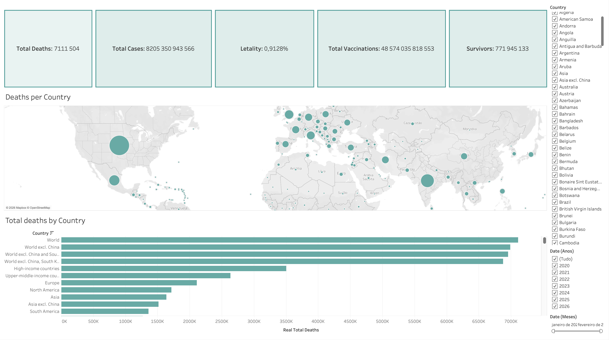
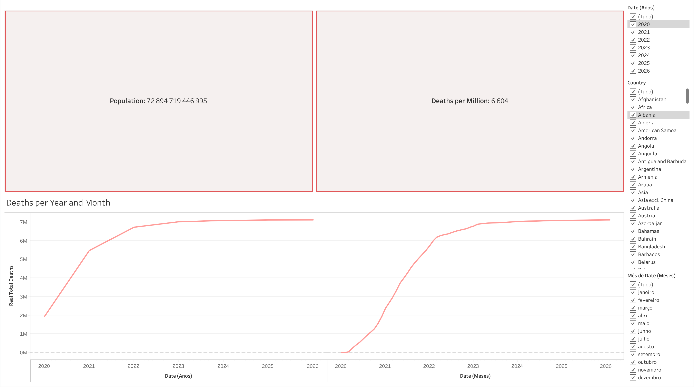

# Análise Visual da Evolução Global da Covid-19

## Contexto
O dataset escolhido para foi o **Covid-19 Dataset**. A solução foi desenvolvida em **Tableau**, através da construção de dashboards interativos orientados para a análise temporal e geográfica da evolução da pandemia. 

## Objetivos do projeto
Este trabalho tem como principal finalidade explorar a evolução da pandemia de Covid-19 à escala global, com foco em indicadores epidemiológicos essenciais, nomeadamente o número total de casos, o número total de mortes, a letalidade e a vacinação.

Os objetivos específicos definidos para a visualização foram os seguintes:

- Compreender a evolução temporal do número total de mortes por Covid-19.
- Comparar o impacto da pandemia entre países e regiões.
- Relacionar indicadores globais como casos, mortes, letalidade e vacinação.
- Disponibilizar filtros interativos que permitam ao utilizador explorar diferentes países, anos e meses.
- Comunicar os principais padrões da pandemia de forma visual e intuitiva.

## Dataset utilizado
O conjunto de dados utilizado contém informação diária por país sobre diversos indicadores associados à pandemia, incluindo casos, mortes, vacinação, hospitalizações, testes e variáveis demográficas.

Este tipo de estrutura permitiu analisar simultaneamente valores acumulados, métricas diárias e indicadores relativos por população.

## Pré-processamento e transformações realizadas
Antes da construção dos dashboards, foi necessário realizar um conjunto de transformações e decisões de modelação dos dados, de modo a garantir que os indicadores apresentados eram consistentes e interpretáveis.

### 1. Conversão do campo de data
O campo `date` foi convertido para o tipo **Date** no Tableau, permitindo extrair corretamente o ano e o mês.

### 2. Identificação de variáveis cumulativas
Uma parte importante do dataset é composta por variáveis **cumulativas**, ou seja, variáveis cujo valor vai aumentando ao longo do tempo para cada país. Exemplos relevantes incluem:

- `total_cases`
- `total_deaths`
- `total_vaccinations`
- `people_vaccinated`
- `people_fully_vaccinated`

Nestas situações, não foi utilizada a soma direta dos valores ao longo do tempo, porque isso produziria resultados incorretos. Em vez disso, foi considerado o **valor máximo por país**, assumindo que o maior valor corresponde ao valor acumulado final disponível para esse país.

### 3. Criação de medidas calculadas
Foram criadas várias medidas calculadas para suportar os dashboards, nomeadamente:

- **Real Total Deaths**: valor máximo de `total_deaths` por país.
- **Real total deaths per million**: valor máximo de `total_deaths_per_million` por país.
- **Survivors**: diferença entre total de casos e total de mortes.
- **Letality**: taxa de letalidade calculada pela fórmula:

```text
(MAX([total_deaths]) / MAX([total_cases])) * 100
```

Esta abordagem foi necessária para evitar erros associados ao uso de variáveis cumulativas em visualizações agregadas.

### 4. Tratamento da agregação
Como o Tableau não permite misturar expressões agregadas e não agregadas no mesmo cálculo, todas as medidas derivadas de variáveis cumulativas foram construídas com funções de agregação coerentes, sobretudo `MAX()`, garantindo consistência no cálculo das métricas finais.

### 5. Criação de filtros temporais
Foram criados campos auxiliares para permitir filtragem por:

- Ano
- Mês
- País

Estes filtros foram integrados nos dashboards para permitir uma navegação interativa dos dados.

## Dashboards desenvolvidos
O projeto foi organizado em dois dashboards principais, cada um com objetivos analíticos distintos mas complementares.

## Dashboard 1 — Visão global e distribuição geográfica
O primeiro dashboard oferece uma visão global do impacto da pandemia, reunindo indicadores-chave e visualizações geográficas. [Dashboard 1](Summary_1.png)

### Componentes principais
- **KPIs globais**:
  - Total Deaths
  - Total Cases
  - Letality
  - Total Vaccinations
  - Survivors
- **Mapa mundial com mortes por país**, usando círculos proporcionais ao número de mortes.
- **Gráfico de barras horizontal** com o total de mortes por país/região, permitindo identificar rapidamente os territórios com maior impacto acumulado.
- **Filtros por país, ano e mês**, permitindo refinar a análise.

### Objetivo analítico
Este dashboard foi pensado para responder a perguntas como:

- Quais foram os países ou regiões com maior número total de mortes?
- Como se distribui geograficamente o impacto da pandemia?
- Qual a relação global entre casos, mortes, sobreviventes e vacinação?

### Principais impressões
A combinação entre KPIs, mapa e gráfico de barras permite perceber rapidamente que o impacto da Covid-19 não foi homogéneo entre regiões e que os valores absolutos de mortes variam significativamente entre países.

---

## Dashboard 2 — Evolução temporal das mortes
O segundo dashboard centra-se na componente temporal, procurando mostrar como o número total de mortes evoluiu ao longo do tempo, tanto por ano como por mês. [Dashboard 2](Summary_2.png)

### Componentes principais
- **KPI Population**, usado como referência de escala global.
- **KPI Deaths per Million**, útil para normalizar a análise em função da população.
- **Gráfico de linha “Deaths per Year and Month”**, representando a evolução do número acumulado de mortes ao longo do tempo.
- **Filtros por ano, país e mês**, permitindo observar subconjuntos do dataset e comparar períodos específicos.

### Objetivo analítico
Este dashboard pretende responder a questões como:

- Em que períodos se verificou o maior crescimento acumulado de mortes?
- Em que momento a evolução começou a estabilizar?
- Como varia a leitura temporal quando são aplicados filtros por país ou por período?

### Principais impressões
A visualização temporal mostra uma subida muito acentuada durante as fases mais críticas da pandemia, seguida de uma desaceleração progressiva nos anos mais recentes, refletindo a estabilização dos valores acumulados.

## Decisões de visualização
Na construção dos dashboards foram tomadas várias decisões com o objetivo de melhorar a legibilidade e a eficácia comunicativa:

- Utilização de **KPIs no topo** para destacar as métricas mais importantes.
- Uso de **mapa mundial** para análise geográfica imediata.
- Uso de **gráficos de barras horizontais** para facilitar comparação entre países/regiões.
- Uso de **gráficos de linha** para representar evolução temporal.
- Inclusão de **filtros laterais** para facilitar a exploração interativa.
- Organização dos elementos de forma simples e limpa, privilegiando clareza em vez de excesso de elementos visuais.

## Resultados e principais conclusões
A análise visual permitiu identificar vários padrões relevantes:

- A pandemia teve um impacto global muito expressivo em número de casos e mortes.
- O número acumulado de mortes cresceu rapidamente nos primeiros anos e mostrou tendência para estabilização posterior.
- Existem diferenças significativas entre países e regiões, quer em valores absolutos, quer em valores relativos por população.
- A utilização de métricas acumuladas exige cuidado metodológico, sendo essencial distinguir entre variáveis cumulativas e variáveis diárias.
- A vacinação constitui uma dimensão importante da análise, permitindo contextualizar a evolução da pandemia e a resposta global ao problema.

## Limitações
Apesar de os dashboards permitirem uma análise global consistente, existem algumas limitações importantes:

- Algumas variáveis apresentam valores em falta para determinados países ou períodos.
- A presença de regiões agregadas no dataset (por exemplo, continentes ou grupos económicos) pode influenciar comparações com países individuais.
- Métricas cumulativas requerem tratamentos específicos, caso contrário podem originar interpretações incorretas.
- O dashboard atual privilegia uma visão descritiva e exploratória, não incluindo modelação preditiva nem análise causal.

## Capturas de ecrã
### Dashboard 1 — Visão global e distribuição geográfica


### Dashboard 2 — Evolução temporal das mortes

